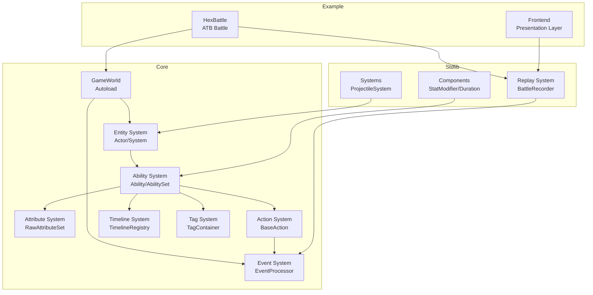

# Logic Game Framework 使用规范（详细版）

> Canonical rules live in SKILL.md. This file expands examples, error cases, and architecture diagrams only.

## Contents
- [1. 属性访问规范](#1-属性访问规范)
- [2. Actor 创建与注册规范](#2-actor-创建与注册规范)
- [3. 实例化与状态约束 (CRITICAL)](#3-实例化与状态约束critical)
- [4. GameStateProvider 的 Variant 设计](#4-gamestateprovider-的-variant-设计)
- [5. Resolvers — 参数解析器](#5-resolvers--参数解析器)
- [6. PreEventConfig handler 规范](#6-preeventconfig-handler-规范)
- [7. GameWorld 硬依赖](#7-gameworld-硬依赖)
- [系统架构](#系统架构)

---

## 1. 属性访问规范

针对拥有 attribute_set 的 actor，**直接访问 `actor.attribute_set`，不要为每个属性创建 getter/setter**。

```gdscript
# ✅ 推荐
var hp := actor.attribute_set.hp
actor.attribute_set.hp -= damage

# ❌ 不推荐
func get_hp() -> float:
    return attribute_set.hp
```

**例外：语义化方法** — 只为包含业务逻辑的操作封装方法：

```gdscript
class_name CharacterActor extends Node

var attribute_set: AttributeSet  # 公开访问

# ✅ 有业务逻辑
func is_alive() -> bool:
    return attribute_set.hp > 0

func take_damage(amount: float) -> void:
    var old_hp := attribute_set.hp
    attribute_set.hp = max(0, attribute_set.hp - amount)
    if old_hp > 0 and attribute_set.hp <= 0:
        emit_signal("died")
```

---

## 2. Actor 创建与注册规范

### 核心流程

1. **构造**：`SomeActor.new(...)` 创建实例，尚未分配完整 ID
2. **注册**：`gameplay_instance.add_actor(actor)` 注册到 GameplayInstance，框架分配 `{instance_id}:{local_id}` 格式 ID

```gdscript
# ✅ 先 new，再 add_actor
var actor := CharacterActor.new(char_class)
instance.add_actor(actor)

# ✅ 在 Action 中通过 source actor 获取所属 instance
var source_actor := GameWorld.get_actor(source_actor_id)
var instance := source_actor.get_owner_gameplay_instance()
instance.add_actor(projectile)
```

### ID 分配规则

| 阶段 | Actor._id | 说明 |
|------|-----------|------|
| `SomeActor.new()` 后 | 空字符串 | 子类 `_init` 中**不要**生成 ID |
| `add_actor()` 后 | `{instance_id}:{local_id}` | 框架自动生成，调用 `_on_id_assigned()` |

### `_on_id_assigned()` 回调

子类如果在 `_init` 中创建了依赖 `get_id()` 的组件，**必须覆盖此方法同步引用**：

```gdscript
func _on_id_assigned() -> void:
    ability_set.owner_actor_id = get_id()
    attribute_set.actor_id = get_id()
```

### `get_owner_gameplay_instance()`

类似 UE 的 `GetWorld()`。内部通过存储 `_instance_id: String` 并查询 `GameWorld.get_instance_by_id()` 实现，避免 RefCounted 循环引用。

---

## 3. 实例化与状态约束（CRITICAL）

### 对象分类

| 分类 | 创建方式 | 实例归属 | 可否持有状态 |
|------|---------|---------|-------------|
| Ability | `AbilityConfig` → 每角色创建新实例 | 每个角色独立 | ✅ 可以 |
| AbilityComponent | `ActiveUseComponent.new(cfg)` 等 | 每个 Ability 独立 | ✅ 可以 |
| **Action** | `.new(...)` 在 `static var` 中创建 | **所有角色共享** | ❌ 禁止 |
| **Condition** | 同 Action | **所有角色共享** | ❌ 禁止 |
| **Cost** | 同 Action | **所有角色共享** | ❌ 禁止 |
| **TriggerConfig** | `TriggerConfig.new(...)` 在 `static var` 或 Builder 中 | **所有角色共享** | ❌ 禁止 |

### 为什么会共享 — 引用传递链路

技能配置使用 `static var`，类加载时只执行一次 `.new()`：

```gdscript
static var SLASH_ABILITY := (
    AbilityConfig.builder()
    .active_use(
        ActiveUseConfig.builder()
        .on_tag(TimelineTags.HIT, [DamageAction.new(...)])  # 只创建一次！
        .build()
    )
    .build()
)
```

虽然每个角色通过 AbilityConfig 创建独立的 Ability 和 Component，但 Component 内部的 Action/Condition/Cost **仍然是引用传递**：

```
AbilityConfig (static var, 单例)
    ↓ 存储 ActiveUseConfig 引用
Ability._resolve_components()  → ✅ 每个角色创建新 Ability
    ↓ ActiveUseComponent.new(cfg)  → ✅ 每个 Ability 创建新 Component
ActiveUseComponent._init()
    ↓ ActivateInstanceConfig.new(config.tag_actions, ...)  → ⚠️ 引用传递！
ActivateInstanceComponent._init()
    ↓ _tag_actions = config.tag_actions  → ❌ Dictionary 引用拷贝，Action 对象共享！

结果：角色 A 和角色 B 的 Component 持有同一个 DamageAction 实例
```

### RULE: `execute()` / `check()` / `pay()` MUST NOT modify `self`

```gdscript
# ❌ 错误：Action 内部有可变状态
class BadAction extends Action.BaseAction:
    var _count := 0
    func execute(ctx: ExecutionContext) -> void:
        _count += 1  # 禁止！修改了 self，会污染其他角色

# ✅ 正确：状态存放在外部（AbilitySet.tag_container）
class GoodAction extends Action.BaseAction:
    func execute(ctx: ExecutionContext) -> void:
        var ability_set := _get_owner_ability_set(ctx)
        var count: int = ability_set.tag_container.get_stacks("my_counter")
        ability_set.tag_container.apply_tag("my_counter", -1.0, count + 1)
```

### 状态存放位置

| 状态类型 | 存放位置 | 示例 |
|---------|---------|------|
| 跨技能状态 | `AbilitySet.tag_container` | Buff、全局效果 |
| 单技能跨次施法状态 | `AbilitySet.tag_container`（Tag + Stacks） | 连击计数、PRD |
| 单次施法内状态 | `execute()` 局部变量 | 弹跳目标列表 |

### Debug 检测

在 Project Settings 中启用：
```
logic_game_framework/debug/action_state_check = true
```

或代码中：
```gdscript
ProjectSettings.set_setting("logic_game_framework/debug/action_state_check", true)
```

---

## 4. GameStateProvider 的 Variant 设计

`IGameStateProvider.get_game_state()` **故意返回 `Variant` 类型**。框架层不限定游戏状态的具体类型（可能是 Dictionary、RefCounted、Node）。

**这是框架中唯一合理的 Variant 返回。** 其他函数使用 Variant 通常是设计失误。

---

## 5. Resolvers — 参数解析器

类型安全的延迟求值参数，用于 Action 等共享对象。

| Resolver | 返回类型 | 固定值 | 动态值 |
|----------|---------|--------|--------|
| `FloatResolver` | `float` | `Resolvers.float_val(v)` | `Resolvers.float_fn(fn)` |
| `IntResolver` | `int` | `Resolvers.int_val(v)` | `Resolvers.int_fn(fn)` |
| `StringResolver` | `String` | `Resolvers.str_val(v)` | `Resolvers.str_fn(fn)` |
| `DictResolver` | `Dictionary` | `Resolvers.dict_val(v)` | `Resolvers.dict_fn(fn)` |
| `Vector3Resolver` | `Vector3` | `Resolvers.vec3_val(v)` | `Resolvers.vec3_fn(fn)` |

`ParamResolver.resolve_param(resolver: Variant, ctx)` 接受 Variant 是合理设计 — 需同时处理所有 Resolver 类型和原始 Callable。新代码优先用类型化 Resolver。

---

## 6. PreEventConfig handler 规范

### 签名

handler **必须**满足：`func(MutableEvent, AbilityLifecycleContext) -> Intent`

**返回值必须是 Intent，不可省略 return。** 框架运行时通过 assert 校验，忘写 return 导致的 null 会立即断言失败。

### Intent 选项

| 返回值 | 含义 | 使用场景 |
|--------|------|----------|
| `EventPhase.pass_intent()` | 放行 | 条件不满足时跳过 |
| `EventPhase.modify_intent(id, [Modification])` | 修改事件字段 | 减伤、增伤 |
| `EventPhase.cancel_intent(id, reason)` | 取消事件 | 免疫、格挡 |

### 完整构造示例

```gdscript
# ✅ 带 filter 的完整 PreEventConfig
PreEventConfig.new(
    "pre_damage",
    func(mutable: MutableEvent, ctx: AbilityLifecycleContext) -> Intent:
        return EventPhase.modify_intent(ctx.ability.id, [
            Modification.multiply("damage", 0.7),
        ]),
    func(event: Dictionary, ctx: AbilityLifecycleContext) -> bool:
        return event.get("target_actor_id") == ctx.owner_actor_id,
    "减伤30%"
)

# ✅ 条件判断，每个分支都返回 Intent
PreEventConfig.new(
    "pre_damage",
    func(mutable: MutableEvent, ctx: AbilityLifecycleContext) -> Intent:
        if some_condition:
            return EventPhase.cancel_intent(ctx.ability.id, "immune")
        return EventPhase.pass_intent()
)
```

### 常见错误

```gdscript
# ❌ 忘记 return → null → 运行时 assert 失败
func(mutable: MutableEvent, ctx: AbilityLifecycleContext) -> Intent:
    EventPhase.modify_intent(ctx.ability.id, [...])
    # 缺少 return！

# ❌ 返回了非 Intent 类型
func(mutable: MutableEvent, ctx: AbilityLifecycleContext) -> Intent:
    return true  # bool 不是 Intent
```

### filter（可选）

签名：`func(Dictionary, AbilityLifecycleContext) -> bool`

返回 `true` 表示该事件应被此 handler 处理。不传 filter 则处理所有匹配 event_kind 的事件。

---

## 7. GameWorld 硬依赖

框架内多处直接引用 `GameWorld` Autoload。这是合理的设计权衡，不视为缺陷，不要尝试解耦。

---

## 系统架构

### 核心模块依赖



### 关键数据流

**技能执行流程：**
```
用户输入 → AbilityComponent.on_event()
    ↓ 检查 Triggers/Conditions/Costs
AbilityExecutionInstance.tick()
    ↓ Timeline 时间点触发
Action.execute()
    ↓ Pre-Event 处理（减伤/免疫）
原子操作（push事件 + 应用状态）
    ↓ Post-Event 处理（反伤/吸血）
EventCollector 收集（录像）
```

**属性修改流程：**
```
StatModifierComponent.on_apply()
    ↓ 创建 AttributeModifier
RawAttributeSet.add_modifier()
    ↓ 标记 dirty
Actor 访问属性
    ↓ get_current_value()
AttributeCalculator.calculate()
    ↓ 四层公式: ((base + addBase) × mulBase + addFinal) × mulFinal
返回 AttributeBreakdown
```

**事件处理流程：**
```
Action 推送事件
    ↓
EventProcessor.process_pre_event()
    ↓ 遍历 Pre Handlers
    ↓ 收集 Intent (PASS/MODIFY/CANCEL)
    ↓ 应用修改
MutableEvent 返回
    ↓ Action 检查是否取消
EventProcessor.process_post_event()
    ↓ 广播给所有存活 Actor
    ↓ 触发被动技能
EventCollector.push()
```
