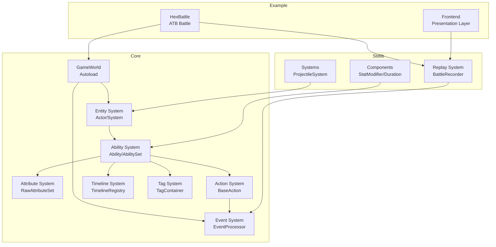

# Logic Game Framework - Architecture Overview

> **Coding conventions** have been moved to the `lgf` skill (`.opencode/skill/lgf/SKILL.md`).
> Use `load_skills=["lgf"]` when delegating tasks that involve this framework.

---

## Core Module Dependencies



## Key Data Flows

### 1. Ability Execution Flow
```
User Input → AbilityComponent.on_event()
    ↓ Check Triggers/Conditions/Costs
AbilityExecutionInstance.tick()
    ↓ Timeline keyframe triggers
Action.execute()
    ↓ Pre-Event processing (damage reduction/immunity)
Atomic operations (push event + apply state)
    ↓ Post-Event processing (thorns/lifesteal)
EventCollector collects (replay recording)
```

### 2. Attribute Modification Flow
```
StatModifierComponent.on_apply()
    ↓ Create AttributeModifier
RawAttributeSet.add_modifier()
    ↓ Mark dirty
Actor accesses attribute
    ↓ get_current_value()
AttributeCalculator.calculate()
    ↓ 4-layer formula calculation
Return AttributeBreakdown
```

### 3. Event Processing Flow
```
Action pushes event
    ↓
EventProcessor.process_pre_event()
    ↓ Iterate Pre Handlers
    ↓ Collect Intent (PASS/MODIFY/CANCEL)
    ↓ Apply modifications
MutableEvent returned
    ↓ Action checks if cancelled
EventProcessor.process_post_event()
    ↓ Broadcast to all alive Actors
    ↓ Trigger passive abilities
EventCollector.push()
```