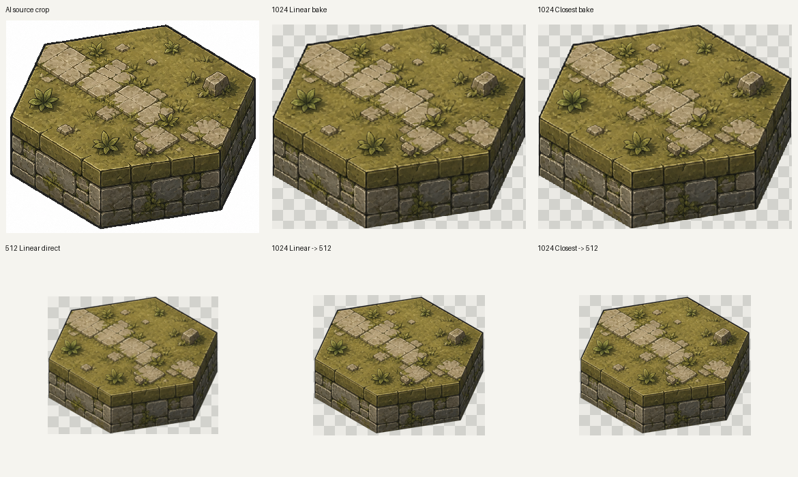
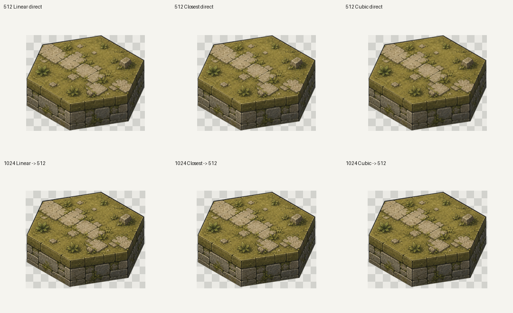
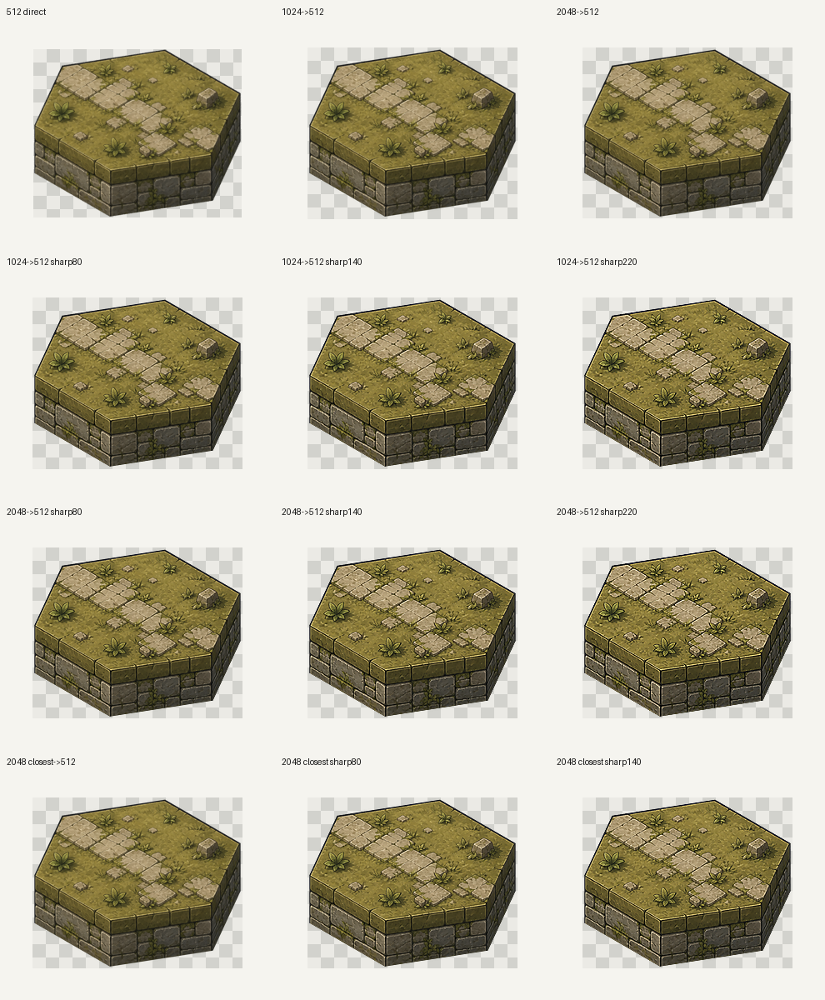
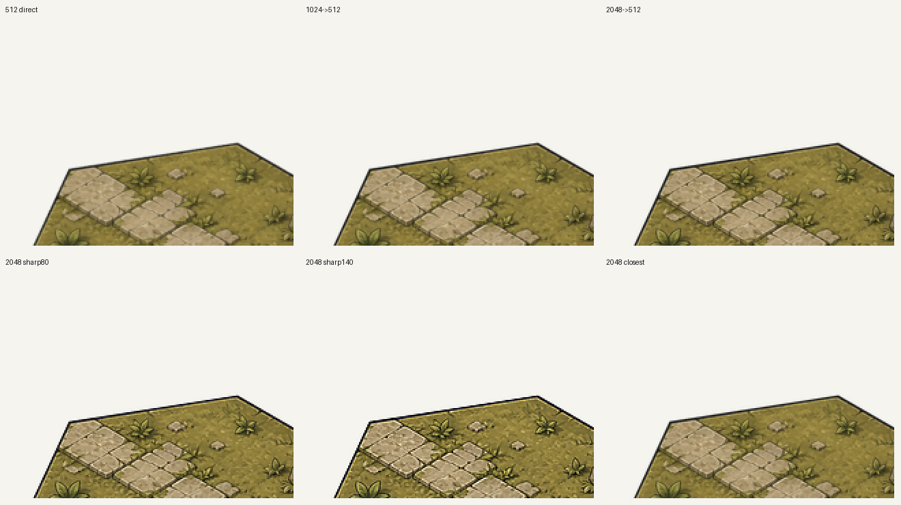
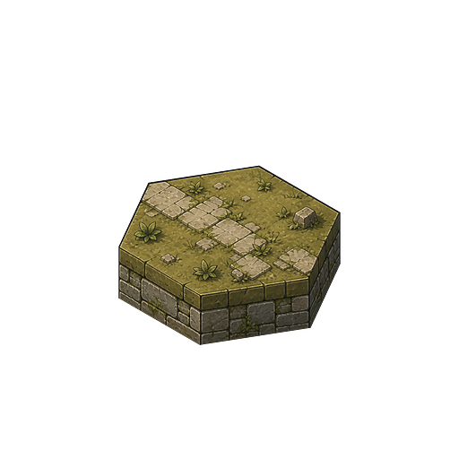

# Tile Texture Quality Bake Report

Date: 2026-06-17

## Context

Input source:

`C:\Users\37065\AppData\Roaming\InkMon\Lab\texture-gen\calls\call_mqgogmei_7yh4z\outputs\output_01.png`

Fit / UV source:

`blender/textures/_candidates/user-fit-20260617-03/uv_source_cut_variants/original_both_faces_own_warp_uv.png`

All tested outputs were rendered through the Blender 3D hex-prism tile model:

`AI PNG -> fitted UV texture -> Blender hex prism material -> orthographic camera render -> optional downsample / sharpen`

They were not direct PNG crops pasted into the result.

## Round 1: Resolution And Texture Interpolation

Tested variants:

- `512 Linear direct`
- `512 Closest direct`
- `512 Cubic direct`
- `1024 Linear direct`
- `1024 Closest direct`
- `1024 Cubic direct`
- `1024 -> 512 Lanczos` variants

Key visual sheets:





Result:

- `512 Linear direct` is visibly softer than the AI source.
- `1024 Linear bake` is much closer to the AI source.
- For final `512` output, `1024 -> 512 Lanczos` keeps more stone cracks, grass texture, and wall brick detail than direct `512`.
- `Closest` is sharper but can feel too hard / pixel-snappy, so it is not a good default.
- RGB mean drift was around 1 value per channel, so color shift was not the main issue.

Round 1 sharpness metric:

| Variant | Sharpness |
| --- | ---: |
| `512 Linear direct` | 7.957 |
| `512 Closest direct` | 8.207 |
| `512 Cubic direct` | 7.617 |
| `1024 Linear -> 512` | 9.751 |
| `1024 Closest -> 512` | 9.995 |
| `1024 Cubic -> 512` | 9.256 |

Full metrics:

`quality_metrics_round1.json`

## Round 2: Higher Supersample And Sharpening

Tested variants:

- `2048 Linear -> 512 Lanczos`
- `2048 Closest -> 512 Lanczos`
- `1024 Linear -> 512 + UnsharpMask`
- `2048 Linear -> 512 + UnsharpMask`
- `2048 Closest -> 512 + UnsharpMask`

Sharpen settings:

`UnsharpMask(radius=0.75, threshold=2, percent=80/140/220)`

Key visual sheets:





Result:

- `2048 -> 512` is sharper than `1024 -> 512`, but the improvement is smaller than the first jump from direct `512`.
- `2048 Linear -> 512 sharp80` is the best default candidate: clear, but not obviously over-sharpened.
- `sharp140` is usable for preview, but starts making outlines and texture noise feel hard.
- `sharp220` is overdone.
- `Closest` variants are sharp but too hard for default production output.

Round 2 sharpness metric:

| Variant | Sharpness |
| --- | ---: |
| `512 direct` | 7.957 |
| `1024 -> 512` | 9.751 |
| `2048 -> 512` | 10.561 |
| `1024 -> 512 sharp80` | 13.780 |
| `1024 -> 512 sharp140` | 17.012 |
| `1024 -> 512 sharp220` | 21.120 |
| `2048 -> 512 sharp80` | 15.151 |
| `2048 -> 512 sharp140` | 18.775 |
| `2048 -> 512 sharp220` | 23.298 |
| `2048 Closest -> 512` | 10.885 |
| `2048 Closest sharp80` | 15.698 |
| `2048 Closest sharp140` | 19.478 |

Full metrics:

`quality_metrics_round2.json`

Recommended sample:



## Recommendation

Default production-quality candidate bake:

```text
internal bake canvas_px: 2048
internal px_per_unit: 512
texture interpolation: Linear
downsample: Lanczos -> 512
postprocess: UnsharpMask(radius=0.75, percent=80, threshold=2)
```

If runtime / asset budget allows `1024` output, prefer:

```text
canvas_px: 1024
px_per_unit: 256
texture interpolation: Linear
optional mild UnsharpMask(percent=80)
```

Avoid as default:

- direct `512` bake: too soft
- `Closest`: sharp but hard / pixel-snappy
- `sharp220`: over-sharpened

## Files Preserved In This Folder

- `quality_source_compare.png`
- `quality_512_compare.png`
- `quality_sharpen_compare.png`
- `quality_sharpen_zoom.png`
- `quality_metrics_round1.json`
- `quality_metrics_round2.json`
- `recommended_2048_to_512_sharp80.png`

Original temporary experiment folders were cleaned after this report was written:

- `quality-bake-20260617-01`
- `quality-bake-20260617-02`
